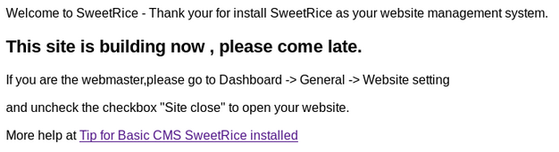
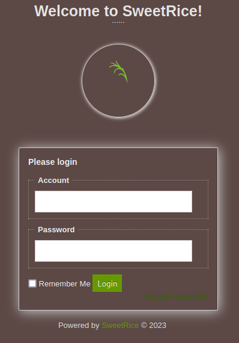

# LazyAdmin - DRAFT

This is an easy box from TryHackMe. The goal is to find user and root flags.

## Enumeration
We start by scanning for open ports:

```console
hacker@parrot$ sudo nmap -sC -sV -oN nmap/init <target_ip>
```
```
-sC for non-intrusive default scripts
-sV for version detection
-oN for output as normal format
```

Nmap comes back with SSH on port 22 and Apache running on port 80. Let's start exploring the site using the browser.


Not much to see, just the default Apache page. Let's enumeration for hidden files and directories using e.g., gobuster:
```console
hacker@parrot$ gobuster dir -u http://<target_ip> -w /usr/share/wordlists/dirb/common.txt
```


The only interesting here is the /content folder. Let go there and have a look.



Turns out to be a CMS system called SweetRice. The tells us there are more content in this subfolder so let's run gobuster again on the /content folder:
```console
hacker@parrot$ gobuster dir -u http://<target_ip>/content -w /usr/share/wordlists/dirb/common.txt
```


A lot more interesting results!



/content/as turns out to be a login page for SweetRice CMS but we con't have any credentials. Trying the obvious admin:admin does not work so let's come back to this after investigating the results from gobuster. Looking in /content/inc we see.


